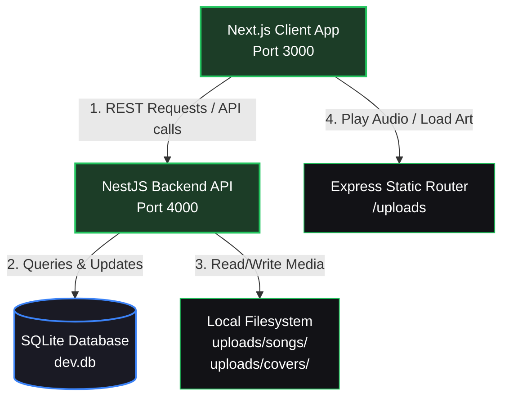

# 🎵 Symphony — Premium Private Music Streaming Player

Symphony is a modern, lightweight, and premium private music player web application designed for personal use and sharing with close friends. It features a stunning, dark-by-default glassmorphic interface inspired by Spotify and Apple Music. Built with high performance, strict TypeScript type safety, and a simple local SQLite database, it requires no heavy container orchestration (Docker/Redis).

---

## 🏗️ System Architecture

The following diagram illustrates how the frontend next-client interacts with the NestJS API server and SQLite database:



---

## ⚡ Tech Stack

| Layer | Technology | Purpose |
| :--- | :--- | :--- |
| **Frontend Core** | Next.js 15 (App Router), TypeScript | Fast SSR/CSR and Type-safe Routing |
| **Styling** | Tailwind CSS v4, Framer Motion | Smooth, glassmorphism UI & Micro-animations |
| **State Management** | Zustand | Highly optimized, fast global audio engine states |
| **Backend Core** | NestJS, Express | Modular, scalable, and secure REST API |
| **Database ORM** | Prisma ORM | Swift, type-safe SQLite database query building |
| **Audio Processing** | music-metadata (Node-native) | Extracts tags (ID3) and album art on upload |

---

## ✨ Premium Features

*   **🔒 Private Access**: Only manual user accounts added to the SQLite database can log in. No public sign-up page.
*   **📂 Easy Uploads**: Drag and drop audio files (MP3, WAV, FLAC). The backend automatically extracts titles, artists, album names, durations, and embedded cover art photos.
*   **📱 Responsive Mobile Layout**: Displays a bottom navigation bar and a sleek mini-player that transitions into a full-screen player.
*   **🔀 Zustand Audio Engine**: Fully reactive player state manager controlling: Play, Pause, Previous, Next, Shuffle, Loop (None/One/All), Seek, Volume, and playback speed.
*   **🔄 Refresh Persistence**: Continues playing the active track, queue context, seek time, and volume level even after a page refresh.
*   **🎹 Keyboard Shortcuts**: Global control shortcuts bind play, skip, shuffle, loop, and volume adjustment (automatically ignored when typing in inputs).
*   **❤️ Liked Songs**: High-fidelity heart buttons with optimistic UI status updates.
*   **📜 Listening History**: Keeps records of recently played songs.
*   **🗂️ Drag & Drop Playlists**: Reorder playlist tracks natively using HTML5 drag-and-drop lists that sync directly with the backend database.
*   **📡 Media Session API**: Background playback support, lock screen controls, and hardware media keys synchronization.

---

## 🚀 Getting Started

### 📋 Prerequisites
- **Node.js**: Version 18.x or newer is recommended.
- **npm**: Installed automatically with Node.js.

### 📥 Project Setup
Follow these steps to configure your environment and run Symphony locally:

1. **Clone the repository**:
   ```bash
   git clone https://github.com/mamurjondeveloper/music-player.git
   cd music-player
   ```

2. **Initialize Backend Configurations**:
   Make sure you check the backend environment variables in `backend/.env`:
   ```env
   DATABASE_URL="file:./dev.db"
   JWT_SECRET="super_secret_music_jwt_key_12345"
   PORT=4000
   ```

3. **Install Dependencies**:
   Open a terminal and install dependencies for both applications:
   ```bash
   # Install backend packages
   cd backend
   npm install
   
   # Run database migrations and seed the default user
   npx prisma migrate dev --name init
   
   # Install frontend packages
   cd ../frontend
   npm install
   ```

---

## 🔑 Default Credentials

The database migration seeds a default account you can use immediately:
- **Username**: `admin`
- **Password**: `password123`

---

## 🎮 Keyboard Shortcuts Cheatsheet

Use these global keys to control playback instantly without clicking:

| Key Binding | Action |
| :--- | :--- |
| **`Space`** | Play / Pause |
| **`Ctrl + ArrowRight`** | Play Next Track |
| **`Ctrl + ArrowLeft`** | Play Previous Track / Restart Song |
| **`Ctrl + ArrowUp`** | Increase Volume (+5%) |
| **`Ctrl + ArrowDown`** | Decrease Volume (-5%) |
| **`L`** | Toggle Loop Mode (None ➡️ Loop All ➡️ Loop One) |
| **`S`** | Toggle Shuffle Mode (On/Off) |

---

## 🏃 Running the Application

Open two terminal windows to run both services simultaneously:

### 1. Start the NestJS backend
```bash
cd backend
npm run start:dev
```
*Backend API starts listening at [http://localhost:4000](http://localhost:4000).*

### 2. Start the Next.js frontend
```bash
cd frontend
npm run dev
```
*Symphony client app starts listening at [http://localhost:3000](http://localhost:3000).*
